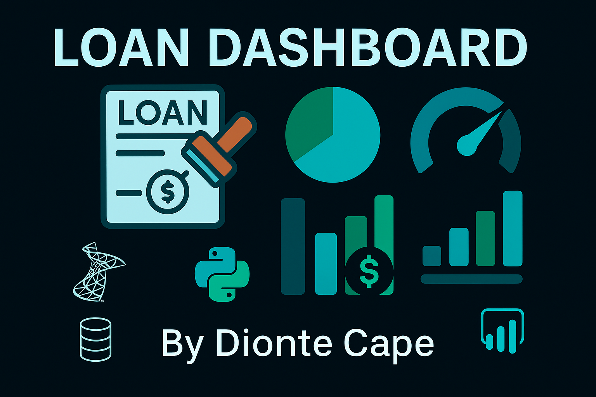

# 💰 Loan Approval Dashboard 📊  
**Created by: Dionte Capleton**

This project explores loan approval trends using Oracle SQL, Python (Pandas), and Power BI. It analyzes which applicant traits—such as credit history, income, gender, and location—most influence approval outcomes using a dataset of 614 applications.

---

## Objective

To identify patterns in loan approval likelihood based on applicant attributes and financial behaviors. The project answers key business questions, such as:
- What factors influence loan approval rates?
- Which demographic groups have higher approval success?
- How do income and loan amounts vary by education, employment, and region?

---

## 📂 Folder Structure
- 🟨 `PowerBI/` - Power BI `.pbix` dashboard
- 🧠 `SQL/` - SQL queries for analysis
- 🐍 `Python/` - Data cleaning + export
- 🖼️ `images/` - Thumbnails + dashboard slides
- 📄 `data/` - Cleaned CSV datasets

---

## Repository Structure

| File | Description |
|------|-------------|
| `Loan2P.sql` | SQL queries used for analysis (joins, aggregations, insights) |
| `loan_project.ipynb` | Google Colab notebook for Python-based cleaning and exploration |
| `loan_case.csv` / `loan_status.csv` | Raw Kaggle data files |
| `loan_case_cleaned.csv` / `loan_status_cleaned.csv` | Cleaned CSVs used in Power BI |
| `loan_dashboard.pbix` | Power BI file (open in Power BI Desktop) |
| `loan_dashboard.pdf` | Static PDF export of final dashboard |
| `README.md` | Project summary and documentation |

---

## 🌟 Key Insights
- ✅ Applicants with strong credit histories had the highest approval rates.
- 🏙️ Semiurban applicants saw notably high loan approval.
- 👩‍💼 Female applicants slightly outperformed male counterparts.
- 💵 Income and property area also influenced approval outcomes.

---

## ❓ Business Problem Tackled  
**Which applicant traits should a bank prioritize to speed up loan approvals and reduce risk?**

---
  
## 📊 Dashboard Preview

📌 *Click the image below to view full dashboard slides (PDF)*

---

## 🚀 How to Use
1. Open `school_vis.pbix` in Power BI _or_ view `school_vis.pdf`.
2. Filter by gender, credit score, property area, etc.
3. Use SQL queries to explore data joins and logic.

---

## Data Source

- The dataset used was sourced from [Kaggle - Loan Prediction Dataset](https://www.kaggle.com/datasets/ajay1735/hloan-data-set). It includes 600+ rows of loan application data across demographics, employment, and loan status fields.

---

## Author

**Dionte Capleton**  
*Aspiring Data Analyst | SQL, Python, Power BI*

